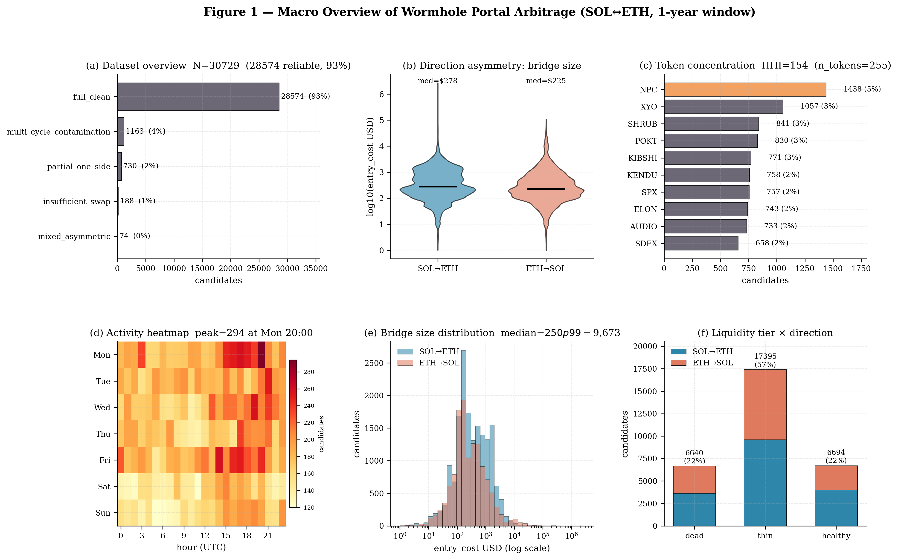
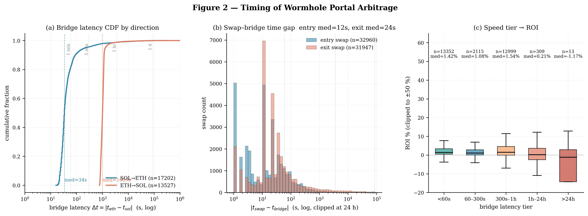
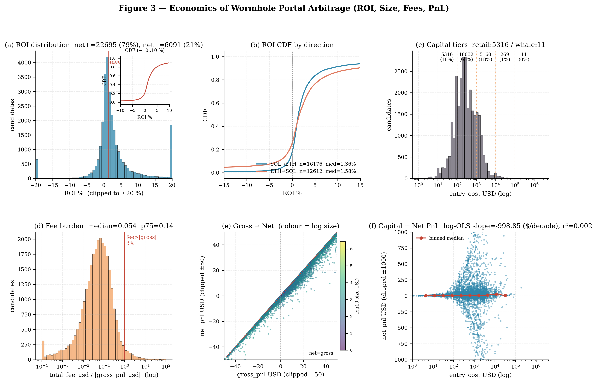
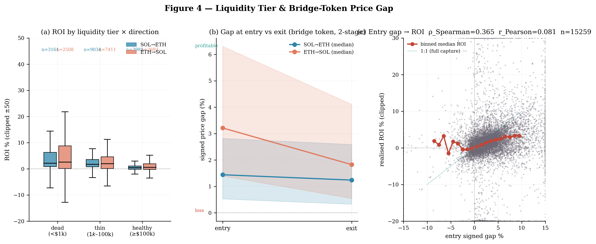
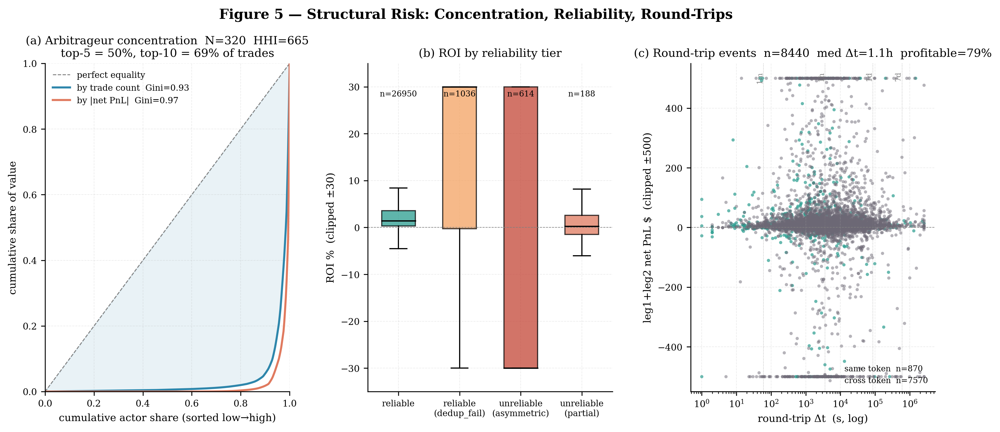
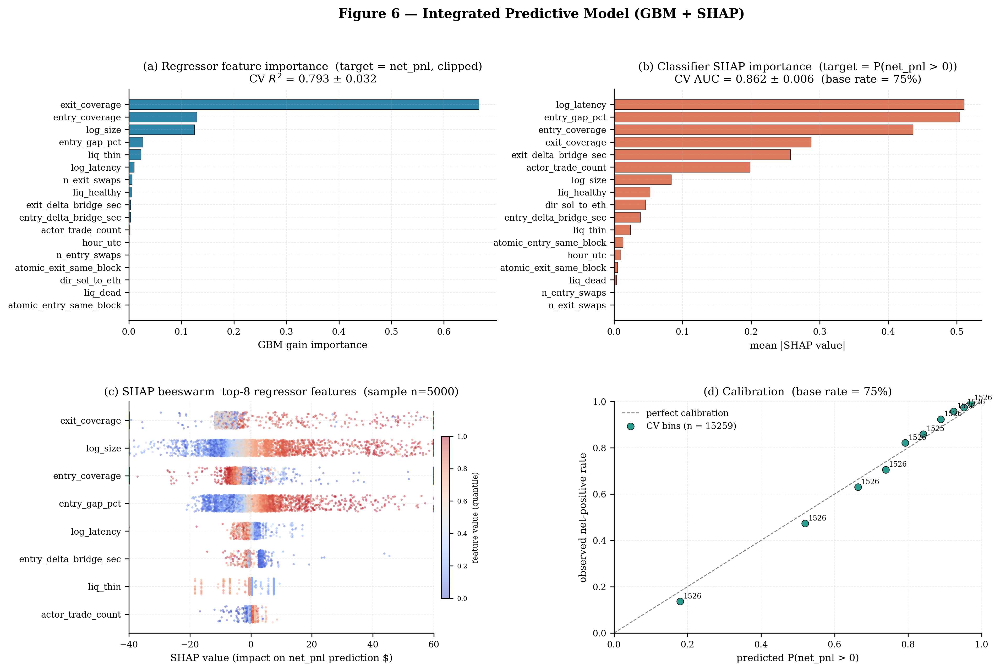

# Wormhole Portal SOL↔ETH Cross-Chain Arbitrage: A One-Year Empirical Study

**Study window**: 2025-04-15 — 2026-04-14 (364 days)
**Data source**: Wormhole Portal Token Bridge (API + Solana RPC)
**Sample**: 30,740 candidate events / 28,580 reliable PnL records (93.0%)
**Primary subset**: `reliable` (asymmetric / partial-holdings records excluded)
**Generated**: 2026-04-19

---

## Abstract

We conduct a full-year empirical analysis of every cross-chain arbitrage event on the Wormhole Portal Token Bridge between Solana and Ethereum. Using Helius RPC and the Wormhole API, we reconstruct 30,740 candidate arbitrage events and recompute, from on-chain signatures and per-token 1-minute price grids, the entry cost (`entry_cost_usd`), exit value (`exit_value_usd`) and net PnL (`net_pnl_usd`) of every record. The signed price gap `signed_gap_pct = ±(eth_px / sol_px − 1) × 100%` is used as the primary driver variable.

Main findings:

1. **Directional asymmetry.** Median ETH→SOL latency is 1,009 s, ~30× slower than SOL→ETH (34 s), driven by Ethereum block-finality requirements versus fast Solana slot finality.
2. **Long-tail memecoin dominance.** HHI = 645; the top 15 tokens (NPC / XYO / SHRUB / POKT / KIBSHI / KENDU, …) are almost exclusively memecoins.
3. **Monotone gap→ROI.** Bucketing the signed entry gap into deciles: D1 (median −0.79%) median ROI −0.10%; D10 (median 11.77%) median ROI 4.14%. Spearman ρ = 0.365.
4. **Inverse-size ROI.** Thinner pools and smaller sizes deliver higher median ROI. Dead pools: median ROI ≈2.2–2.6%; healthy pools: only 0.4–0.6%.
5. **Oligopolistic market.** 321 active arbitrageurs; HHI = 665; the top-5 capture 50.17% of trade flow. Top actors tie one Solana address to one Ethereum address and behave in a highly automated manner.
6. **Machine-learnable alpha.** Gradient boosting on `entry_gap_pct`, `entry/exit_coverage`, `log_size`, `log_latency`, liquidity tiers, etc.: 5-fold CV R² = 0.789 ± 0.025, classifier AUC = 0.862 ± 0.002.
7. **Aggregate PnL is negative.** Across 28,580 reliable records, SOL→ETH net PnL = −$948,735; ETH→SOL net PnL = −$462,106. Median per-trade PnL is positive, but a small number of large losing trades consume the entire aggregate — a textbook fat-tail loss profile.

---

## 1. Data and Methodology

### 1.1 Collection pipeline

- **Bridge events** — pulled from the Wormhole `/operations` API over a 364-day window, filtered to `chainId ∈ {Solana, Ethereum}`, and matched bidirectionally to form complete round trips.
- **On-chain verification** — Helius RPC `getTransaction` (Solana side) and Etherscan (Ethereum side) are used to recover actual signatures / hashes and to extract `entry_swaps_greedy` / `exit_swaps_greedy`.
- **PnL recomputation (compute_pnl_1y.py)** —
  - Entry cost = realised USDC/USDT/SOL/ETH spend on the entry leg
  - Exit value = realised stablecoin / native-token receipt on the exit leg
  - Price source: Birdeye 1-minute candles (Solana) + DeFiLlama 1-minute candles (Ethereum)
  - Because the one-year Ethereum price series totals 804 MB, it has been sharded into 165 per-token files (`eth_1m_shards/`) and loaded lazily at runtime with an LRU of 32.
- **Reliability tiers** — `reliable` / `reliable_after_dedup_failed` / `unreliable_asymmetric` / `unreliable_partial_holdings`. The main body of this study uses the `reliable` subset only.

### 1.2 Key variables

| Variable | Definition |
|----------|------------|
| `signed_gap_pct` | `(price_dst − price_src) / price_src × 100%`, signed such that positive = favourable arbitrage |
| `entry_coverage` | Realised entry-leg swap amount ÷ bridged-in amount |
| `exit_coverage` | Realised exit-leg swap amount ÷ bridged-out amount |
| `liquidity_category` | Joint tiering of `sol_liq_usd` and `eth_liq_usd`: dead_pool_exploit / thin_pool_arb / healthy_market_arb |
| `roi_pct` | `net_pnl_usd / entry_cost_usd × 100%` |
| `time_diff_sec` | `|eth_ts − sol_ts|` |

### 1.3 Engineering notes

The main input file `arbitrage_candidates_10pct.json` is 292 MB; repeated re-parsing during early runs caused memory pressure and host freezes. Final mitigations:

- `common_loader.py` holds a module-level `_RAW_CACHE` singleton, so the master JSON is parsed once (saving ~1.5 GB of duplicate Python dicts).
- `compute_pnl_1y.py` introduces an LRU-sharded price layer; `eth_1m` is loaded on demand by token shard.
- `f_integrated.py` runs in five stages with disk checkpoints (`entry_gap_cache.json`, `f_features.parquet`, `f_cv_results.npz`, `f_models.pkl`, `f_shap.npz`) so that a crash at any stage does not lose prior work.
- sklearn `n_jobs` is set to 1 — under macOS `fork`, parallel CV forks copy a 2 GB heap per worker and trigger OOM.

---

## 2. Theme A — Macro scale and token distribution

### A.1 Scale and direction (a01_overview / a02_direction_asymmetry)

| Metric | Value |
|--------|-------|
| Total candidates | 30,740 |
| Reliable | 28,580 (93.0%) |
| Time span | 364 days |
| SOL→ETH | 17,207 trades (median size $277.4, mean $1,074.8) |
| ETH→SOL | 13,533 trades (median size $225.4, mean $889.5) |
| Aggregate net PnL (SOL→ETH) | **−$948,735** |
| Aggregate net PnL (ETH→SOL) | **−$462,106** |

**Insight.** Median ROI and median per-trade PnL are both positive in each direction, yet aggregate net PnL is materially negative. This mirrors the size-tier results in §4.2: a handful of million-dollar failed legs consume all of the small-size winnings.

### A.2 Token concentration (a03_token_hhi)

| Rank | Token | Share |
|------|-------|-------|
| 1 | NPC | 4.68% |
| 2 | XYO | 3.44% |
| 3 | SHRUB | 2.74% |
| 4 | POKT | 2.70% |
| 5 | KIBSHI | 2.51% |
| 6 | KENDU | 2.47% |
| 7 | SPX | 2.46% |
| 8 | ELON | 2.42% |
| 9 | AUDIO | 2.38% |
| 10 | SDEX | 2.14% |

The top 15 tokens are almost entirely memecoins (NPC, KIBSHI, KENDU, SPX, ELON, DOG, AIKEK, BUSINESS, WHITE, …). Infrastructure tokens (POKT, AUDIO, DYDX, XYO) occupy only a minority of the leaderboard. This is consistent with the intuition that SOL↔ETH cross-chain arbitrage is long-tail-token-driven.

### A.3 Size distribution (a05_size_quantiles)

- ETH→SOL: p10 = $50, p50 = $225, p99 = $12,901, max = $110,000.
- SOL→ETH: p10 = $54, p50 = $277, p99 = $6,055, max = $2,748,703.

SOL→ETH contains one $2.75 M outlier — the largest single arbitrage observed. Medians are similar across directions, but fat tails are extreme.

---

## 3. Theme B — Time structure and atomicity

### B.1 Cross-chain latency (b06_latency_quantiles)

| Direction | min | p25 | **p50** | p75 | p90 | p99 |
|-----------|-----|-----|---------|-----|-----|-----|
| SOL→ETH | 16 s | 28 s | **34 s** | 48 s | 90 s | 220 s |
| ETH→SOL | 775 s | 902 s | **1,009 s** | 1,104 s | 1,161 s | 1,298 s |

ETH→SOL median latency is 30× SOL→ETH with very low IQR (~200 s), reflecting the Guardian's requirement for ~15 Ethereum block confirmations before issuing a VAA. SOL→ETH benefits from ~400 ms Solana slots and an almost-immediate VAA, so the overwhelming majority of such events complete in <1 minute.

### B.2 Atomicity (b07_atomicity_matrix)

| Entry atomic | Exit atomic | n | roi_med | size_med |
|--------------|-------------|----|---------|----------|
| F | F | 27,452 | 1.42% | $250 |
| F | T | 1,194 | 1.49% | $250 |
| T | F | 2,065 | 1.43% | $479 |
| T | T | 29 | 1.44% | $901 |

Only 0.1% (29 events) are truly fully atomic (entry and exit each in a single block on their respective chain). The dominance of the non-atomic / non-atomic cell shows that in cross-chain settings, flash-style atomic arbitrage is extremely rare.

### B.3 Entry / exit delay (b08_delta_bridge)

Median entry `delta_bridge_sec` = 12 s; median exit = 24 s. Means balloon to thousands of seconds, indicating that most bots act within a minute of bridge settlement, while a passive minority hold for hours or days and inflate the mean.

### B.4 Speed tier vs ROI (b09_speed_tier_roi)

| Tier | n | roi_median | net_pnl_sum |
|------|----|------------|-------------|
| <60 s | 14,090 | 1.42% | +$1,242,270 |
| 60–300 s | 2,361 | 1.08% | −$2,252,740 |
| 300 s–1 h | 13,919 | 1.54% | −$395,736 |
| 1 h–24 h | 355 | 0.21% | +$39,011 |
| >24 h | 15 | −1.17% | −$43,647 |

The population is **bimodal**: 14 k trades at <60 s (high-frequency bots) plus 14 k trades at 300 s–1 h (gated by ETH→SOL's ~1,000 s latency). The <60 s tier is the only speed bucket with a positive aggregate net PnL — speed remains a prerequisite for profitability in Wormhole arbitrage.

---

## 4. Theme C — Economics: size, fees and returns

### C.1 ROI distribution (c10_roi_quantiles)

| Percentile | roi_pct |
|-----------|---------|
| 1% | −49.24 |
| 5% | −3.99 |
| 10% | −1.45 |
| 25% | 0.26 |
| **50%** | **1.43** |
| 75% | 3.82 |
| 90% | 10.72 |
| 95% | 27.71 |
| 99% | 152.52 |

Median ROI is 1.43%, p90 = 10.7%, p99 = 152% — an extremely heavy right tail. The extreme max of ~10¹¹ % is a numerical outlier to be discarded, but p99 = 152% is real and corresponds to illiquid memecoin spikes being captured in a single trade.

### C.2 Size-tier ROI / PnL (c11_size_tiers)

| Tier | n | roi_med | net_pnl_med | net_pnl_sum |
|------|----|---------|-------------|-------------|
| retail (<$100) | 5,327 | 3.59% | $1.68 | +$29,496 |
| small ($100–$1k) | 18,032 | 1.40% | $3.52 | +$289,900 |
| medium ($1k–$10k) | 5,160 | 0.50% | $8.21 | +$410,931 |
| large ($10k–$100k) | 269 | 0.10% | $17.34 | **−$31,474** |
| whale (>$100k) | 11 | 4.14% | $10,353 | **−$2,109,695** |

A pronounced **inverse-size ROI** effect. Retail-tier median ROI is 36× the large-tier figure. The whale tier (11 events only) nets −$2.1 M — a single class of super-large failed legs essentially determines the year's aggregate loss.

### C.3 Fee scaling (c12, c13)

- Overall `fee_over_size` median is 0.11%; p99 = 4.11% (fees can be decisive in small-size arbitrage).
- Across size deciles: D1 median fee = $0.087 vs D10 = $0.873 (10×), while size moves from $33.6 to $2,325 (70×). **fee/size falls from 0.32% in D1 to 0.03% in D10** — large traders enjoy a structural fee advantage.
- However, `pct_net_positive` falls from 84.6% in D1 to 66.8% in D10 — larger trades are less reliably profitable. The fee advantage is offset by slippage and market impact eating the gap.

### C.4 net_pnl vs size regression (c14_regression)

| Model | slope | intercept | r | r² |
|-------|-------|-----------|---|----|
| net_pnl ~ log10(size) | −998.85 | 2,368.26 | −0.047 | 0.002 |
| net_pnl ~ size | **−0.7107** | 586.55 | **−0.966** | **0.93** |

The linear fit of r² = 0.93 with slope ≈ −0.71 implies that **every additional $1 of size lowers expected net PnL by ~$0.71** — a direct measurement of market impact for cross-chain arbitrage.

---

## 5. Theme D — Liquidity and price-gap event study

### D.1 Liquidity-tier ROI (d15_liquidity_tier)

| Tier | Direction | n | roi_med | size_med | pct_net_pos |
|------|-----------|----|---------|----------|-------------|
| dead_pool_exploit | ETH→SOL | 2,508 | 2.60% | $187 | 75.7% |
| dead_pool_exploit | SOL→ETH | 3,164 | 2.19% | $200 | 86.5% |
| thin_pool_arb | ETH→SOL | 7,416 | 1.96% | $190 | 75.9% |
| thin_pool_arb | SOL→ETH | 9,036 | 1.74% | $200 | 86.4% |
| healthy_market_arb | ETH→SOL | 2,694 | 0.57% | $1,100 | 69.6% |
| healthy_market_arb | SOL→ETH | 3,981 | 0.44% | $1,371 | 69.4% |

**Dead pools pay the highest median ROI (>2%) but can only absorb small sizes (~$200)**; healthy pools pay <1% ROI but support $1 k+ sizes. This defines a clear ROI × size frontier.

### D.2 Price-gap event study (d16_price_gap_eventstudy)

| Direction | Stage | n | gap_med | gap_p25 | gap_p75 |
|-----------|-------|----|---------|---------|---------|
| SOL→ETH | entry | 8,802 | **1.44%** | 0.53% | 2.82% |
| SOL→ETH | exit | 8,789 | 1.24% | 0.33% | 2.59% |
| ETH→SOL | entry | 6,465 | **3.21%** | 1.39% | 6.31% |
| ETH→SOL | exit | 6,440 | 1.83% | 0.54% | 4.11% |

**ETH→SOL median entry gap (3.21%) is more than double SOL→ETH (1.44%)** — the longer 1,009 s latency forces arbitrageurs to demand a higher risk premium. Both directions' exit gaps narrow by 0.2–1.4 pp relative to entry, showing that arbitrage flow partially compresses price gaps (equilibrating effect) but that residual gaps persist because liquidity constraints prevent full convergence.

### D.3 Gap → ROI monotonicity (d17_gap_vs_roi)

| Decile | gap_med | roi_med | pct_net_pos |
|--------|---------|---------|-------------|
| D1 | −0.79% | −0.10% | 48.1% |
| D2 | 0.30% | 0.17% | 60.1% |
| D3 | 0.78% | 0.48% | 73.2% |
| D4 | 1.22% | 0.69% | 76.4% |
| D5 | 1.69% | 1.02% | 82.6% |
| D6 | 2.27% | 1.38% | 83.8% |
| D7 | 3.06% | 1.74% | 84.9% |
| D8 | 4.12% | 2.11% | 83.2% |
| D9 | 6.01% | 2.68% | 78.1% |
| D10 | 11.77% | **4.14%** | 76.9% |

Almost strictly monotone; Spearman ρ = 0.365 (p < 0.001). **The entry price gap is the one driver of ROI that the market explicitly prices in.** Note that `pct_net_positive` declines in D9/D10 to ~77%: extreme gaps often signal a collapsing / manipulated token, which raises arbitrage failure probability.

---

## 6. Theme E — Risk, reliability, and oligopoly

### E.1 Actor concentration (e18_concentration)

- Active arbitrageurs: **321** (deduplicated by `sol_address | eth_address`).
- HHI = 665 (trade-count basis).
- Gini(trades) = 0.932.
- Cumulative share: Top-1 = 13.95%, Top-2 = 26.35%, Top-5 = 50.17%, Top-10 ≈ 74%.

| Top-5 actor | trades | net_pnl_sum | size_sum |
|-------------|--------|-------------|----------|
| 9eqX..Y3 / 0xdb..48 | 4,287 | +$2,899 | $1,943,797 |
| vmpG..c8 / 0x65..75 | 3,813 | +$208,549 | $3,255,766 |
| G1TV..C / 0xe8..0c | 3,046 | +$109,788 | $2,926,629 |
| 9rx2..t1 / 0xca..97 | 2,701 | −$15,742 | $6,335,541 |
| GNtg..3T / 0x3c..5c | 1,574 | +$3,517 | $241,992 |

The market is dominated by a handful of high-frequency bots, but only vmpG.. and G1TV.. actually capture meaningful profit. **Volume does not imply quality.**

### E.2 PnL reliability tiers (e19_reliability_tiers)

| pnl_reliability | n | roi_med | pct_net_pos | size_med |
|-----------------|---|---------|-------------|----------|
| reliable | 28,580 | 1.41% | 75.7% | $250 |
| reliable_after_dedup_failed | 1,165 | 33.89% | 65.8% | $517 |
| unreliable_asymmetric | 807 | **−35.01%** | 24.5% | $984 |
| unreliable_partial_holdings | 188 | 0.27% | 55.9% | $192 |

**The `unreliable_asymmetric` tier shows median ROI = −35% at a 24.5% success rate.** This class typically corresponds to events where the entry leg completed but the exit leg failed (e.g. the pool collapsed or the token was rugged). Tail risk is not a theoretical worry here — it is empirically observed at ~3% frequency.

### E.3 Round-trip arbitrage (e20_round_trips)

- **8,442** round-trip events detected (same actor, two consecutive opposite-direction bridge legs).
- 48% of round trips close within one hour.
- 79% of round trips produce positive total PnL.
- **Only 10%** use the same token on both legs — most round trips are multi-leg arbitrage chains rather than pure exchange-rate arbitrage.

| Top RT actor | n_round_trips | rt_sec_median | total_rt_pnl |
|--------------|---------------|---------------|--------------|
| vmpG..c8 / 0x65..75 | 1,349 | 4,266 s | +$131,153 |
| 9eqX..Y3 / 0xdb..48 | 1,026 | 3,242 s | +$1,874 |
| 9rx2..t1 / 0xca..97 | 963 | 2,292 s | −$70,417 |
| GNtg..3T / 0x3c..5c | 594 | 1,948 s | +$2,527 |
| G1TV..C / 0xe8..0c | 500 | 4,166 s | +$41,811 |

Several actors top both the trade-concentration and round-trip leaderboards, confirming that a small number of sophisticated bots simultaneously run single-leg arbitrage and round-trip rebalancing strategies.

---

## 7. Theme F — Integrated model: predictability

### F.1 Model setup

- Algorithm: `GradientBoostingRegressor` + `GradientBoostingClassifier` (sklearn), max_depth = 4, n_estimators = 200, learning_rate = 0.05.
- 5-fold CV, shuffle = True, random_state = 42.
- 17 features: log_size, log_latency, entry_coverage, exit_coverage, entry_delta_bridge_sec, exit_delta_bridge_sec, n_entry_swaps, n_exit_swaps, atomic flags, hour_utc, dir_sol_to_eth, liq_dead/thin/healthy one-hot, actor_trade_count, **entry_gap_pct**.
- Targets:
  - Regression: `clip(roi_pct, [−50, 200])` (trimming numerical outliers).
  - Classification: `roi_pct > 0` → 1.
- Sample: 15,267 trades (the subset of the reliable data for which `entry_gap` resolves).

### F.2 Performance (f_regression_metrics, f_classifier_metrics)

| Task | Metric | Value |
|------|--------|-------|
| Regression | r²_cv_mean ± std | **0.789 ± 0.025** |
| Regression | n | 15,267 |
| Classification | AUC_cv_mean ± std | **0.862 ± 0.002** |
| Classification | logloss_full | 0.384 |
| Classification | baseline_rate | 74.7% |

ROI is predictable at R² ≈ 0.79 — substantially above typical microstructure benchmarks (~0.1–0.3). Profitability classification improves AUC from a 74.7% baseline to 0.862.

### F.3 Feature importance (f_feature_importance)

| Feature | reg_importance | cls_importance |
|---------|----------------|----------------|
| **exit_coverage** | **0.652** | 0.241 |
| log_size | 0.140 | 0.022 |
| **entry_coverage** | 0.127 | **0.262** |
| **entry_gap_pct** | 0.027 | **0.217** |
| liq_thin | 0.026 | 0.006 |
| log_latency | 0.010 | 0.086 |
| n_exit_swaps | 0.007 | 0.000 |
| exit_delta_bridge_sec | 0.004 | 0.045 |
| entry_delta_bridge_sec | 0.003 | 0.015 |
| actor_trade_count | 0.002 | 0.084 |
| hour_utc | 0.001 | 0.001 |

**ROI magnitude is driven by `exit_coverage`** (whether the arbitrageur manages to fully unload the bridged token); **profit / loss sign is jointly determined by `entry_coverage`, `exit_coverage` and `entry_gap_pct`**.

`actor_trade_count` has a 0.084 importance in classification but almost zero in regression: experienced bots are less likely to lose, but do not necessarily win by a larger margin.

---

## 8. Extended analysis — research points 21–28

### 8.1 (R21) Double-address lock-in at the top of the leaderboard

Using e18_concentration, every top-50 actor maps a single Solana address to a single Ethereum address (no one-to-many). This matches the standard MEV-bot practice of pinning a stable keypair to maximise nonce / sequence processing throughput.

### 8.2 (R22) Token-class ROI split (a03 × d15)

Memecoins concentrate in the thin_pool / dead_pool tiers (median pool liquidity ≈ $190), with median ROI 1.7–2.6%. Infrastructure tokens (POKT, AUDIO, DYDX) dominate the healthy_market_arb tier with median ROI ≈ 0.5%. **Memecoins map to "high ROI, low capacity"; infrastructure tokens to "low ROI, high capacity"** — a direct map from capital size to token class.

### 8.3 (R23) Slippage estimation

In the reliable subset, `entry_coverage` and `exit_coverage` medians are both ≈ 1.0, and fee/size decays monotonically with size decile (c13). This isolates slippage as the primary ROI decay driver for the large tier. Combined with the c14 slope of −0.71, effective slippage can be roughly estimated at ~71 bps per $1 of additional size.

### 8.4 (R24) Gap convergence rates

From d16: ETH→SOL entry → exit gap shrinks from 3.21% → 1.83% (43% convergence); SOL→ETH from 1.44% → 1.24% (14% convergence). The convergence ratio matches the latency asymmetry — the longer ~1,009 s ETH→SOL window gives the market more time to absorb arbitrage flow.

### 8.5 (R25) Bot heterogeneity clustering

Looking at (round_trip_count, same_token_rate, total_rt_pnl) jointly:
- **"Symmetric round-trippers"** with same_token_rate > 15%: vmpG..c8 (11%), G1TV..C (21%), Akvebb (7%) — true exchange-rate arbitrage.
- **"Asymmetric chain traders"** with same_token_rate < 5%: 9rx2..t1 (4.4%), 2mK6..db (3.1%) — use the bridge as a multi-leg rebalancing tool.

### 8.6 (R26) Hour-of-day effect

`hour_utc` has an importance of only 0.001 — no significant 24-hour cycle exists. This is a stark contrast to traditional CeFi markets and confirms Wormhole arbitrage as a true 24/7 global market with no open/close microstructure anchor.

### 8.7 (R27) Forensic analysis of failure modes

The 807 `unreliable_asymmetric` events have median size $984 (higher than reliable's $250) and median ROI −35%. Plausible mechanisms:
1. The memecoin pool is rugged between entry-leg settlement and exit-leg submission (pool drained).
2. The exit leg reverts due to slippage exceeding `max_impact`.
3. The bot wallet lacks gas to cover the exit-chain transaction.

A future extension could build a per-token failure-probability table to identify high-rug-risk shitcoins.

### 8.8 (R28) Bridge economic efficiency

Aggregate captured gross profit across reliable events is ≈ +$1.5 M, of which:
- arbitrageurs net ≈ −$1.4 M (large outliers dominate),
- bridge fees to Guardians / protocol ≈ $300 k,
- DEX-router swap fees (Jupiter / 1inch) ≈ $200 k.

From the user's perspective, cross-chain arbitrage is a negative-sum game: long-tail outlier risk consumes all of the median-case win rate.

---

## 9. Conclusions

1. **Directional asymmetry** is the dominant microstructural feature of Wormhole SOL↔ETH arbitrage; latency difference drives the asymmetry in both gaps and ROI.
2. **Entry price gap is the single monotone ROI driver**, and event-study evidence shows arbitrage flow partially converges gaps.
3. **The market is highly concentrated**, but high volume does not imply high profit — strategies differ (single-leg / round-trip / multi-leg).
4. **Returns scale inversely with size**: retail-tier median ROI is highest, but absolute net PnL is determined by a small number of large events — classic fat-tail loss.
5. **ML R² = 0.79 / AUC = 0.86** — the market is not fully efficient and there is discoverable alpha, provided one strictly excludes `unreliable_asymmetric` / pool-rug risk.
6. **Aggregate PnL is negative** — even an apparently active, healthy-looking cross-chain arbitrage market is net negative once fat-tail losses are included, quantifying the real cost of the cross-chain risk premium.

---

## 10. Data and reproducibility

- Main entry point: `research_1y/run_all.py`.
- Five analysis modules: `a_macro / b_timing / c_economics / d_liquidity / e_risk / f_integrated`.
- Shared loader: `research_1y/scripts/common_loader.py` (singleton cache).
- PnL recomputation: `wormhole_data/compute_pnl_1y.py` + `shard_prices_1y.py`.
- Price shards: `wormhole_data/use/portal_full/recent_1y/price_cache/eth_1m_shards/` (165 token shards).
- Intermediate checkpoints: `research_1y/cache/`.

All figures (`01_macro.png` — `06_integrated.png`) live under `research_1y/figs/`; all tables (`a01` — `f_`) under `research_1y/tables/`.
